# Level Up — MLOps Full Pipeline

End-to-end MLOps pipeline for a lifestyle gamification app. Covers data ingestion, cleaning, validation, feature engineering, model training, bias detection, experiment tracking, CI/CD automation, and alerting — orchestrated with Apache Airflow, versioned with DVC, and tracked with MLflow.

---

## Requirements

- Python 3.11+
- Docker + Docker Compose
- Kaggle API credentials (for dataset downloads)
- GCP service account (for Firestore + GCS)
- Slack webhook URL (for alerts)

---

## Setup

### 1. Clone and configure environment

```bash
git clone https://github.com/LEVELUP-ML/data-pipeline && cd data-pipeline
```

Create a `.env` file (do not commit):

```bash
KAGGLE_USERNAME=your_username
KAGGLE_KEY=your_api_key
AIRFLOW_UID=1000
```

### 2. Add secrets

```bash
mkdir -p secrets
cp /path/to/your/gcp-service-account.json secrets/gcp-sa.json
cp /path/to/your/firebase-admin.json secrets/firebase-admin.json
```

### 3. Start all services

```bash
docker compose up -d
docker compose ps
```

| Service | URL | Credentials |
|---------|-----|-------------|
| Airflow UI | http://localhost:8081 | admin / admin |
| MLflow UI  | http://localhost:5001 | — |

### 4. Initialize DVC

```bash
dvc init
dvc remote add -d gcs_remote gs://your-bucket/dvc-store
dvc remote modify gcs_remote credentialpath secrets/gcp-sa.json

dvc add data/raw
dvc add data/processed

git add dvc.yaml dvc.lock data/raw.dvc data/processed.dvc .dvc/ .gitignore
git commit -m "feat: initialize DVC tracking"
dvc push
```

### 5. Seed Firestore and run the flexibility pipeline

```bash
# Seed 20 users, 90 days of workout data
docker exec airflow-scheduler python /opt/airflow/data_seeding/main.py \
  --service-account /opt/airflow/secrets/firebase-admin.json \
  --num-users 20 --days 90 --write-rollups --seed 42

# Run feature engineering (downloads from Firestore, builds lag features)
docker exec airflow-scheduler airflow dags trigger flexibility_features

# Model DAG triggers automatically on success, or trigger manually
docker exec airflow-scheduler airflow dags trigger flexibility_model
```

### 6. Run Tests

```bash
pip install pytest pytest-cov
pytest
pytest --cov=tests --cov-report=term-missing
```

---

## Reproducing on Another Machine

```bash
# 1. Clone
git clone https://github.com/LEVELUP-ML/data-pipeline && cd data-pipeline

# 2. Environment
cat > .env << EOF
KAGGLE_USERNAME=your_username
KAGGLE_KEY=your_api_key
AIRFLOW_UID=1000
EOF

# 3. Secrets
mkdir -p secrets
cp /path/to/gcp-sa.json secrets/gcp-sa.json
cp /path/to/firebase-admin.json secrets/firebase-admin.json

# 4. Restore data from DVC
pip install "dvc[gs]"
dvc pull

# 5. Start services
docker compose up -d

# 6. Verify
docker compose ps
docker exec -it airflow-scheduler airflow dags list

# 7. Run any pipeline
docker exec -it airflow-scheduler airflow dags trigger download_wisdm_accel
docker exec -it airflow-scheduler airflow dags trigger download_synthetic_from_firestore

# 8. Run tests
pip install -r requirements.txt
pytest
```

### If you don't have GCP credentials

```bash
docker compose up -d

# Kaggle datasets (requires Kaggle credentials only)
docker exec -it airflow-scheduler airflow dags trigger kaggle_download_strength
docker exec -it airflow-scheduler airflow dags trigger clean_weightlifting_data

# Public datasets (no credentials needed)
docker exec -it airflow-scheduler airflow dags trigger download_wisdm_accel
docker exec -it airflow-scheduler airflow dags trigger clean_wisdm_accel_data
docker exec -it airflow-scheduler airflow dags trigger download_food_data
```

---

## Pipeline Architecture

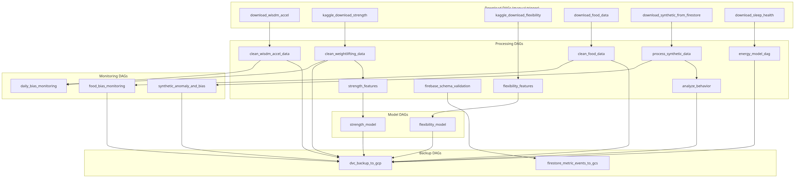

---

## DAG Dependency Details

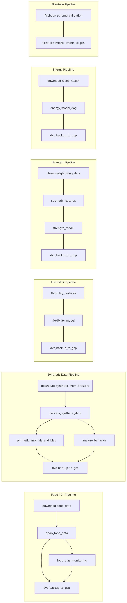


---

## Flexibility Model Pipeline

The flexibility model predicts a user's flexibility score at +1, +3, +7, and +14 days ahead given their last 5 workout sessions.

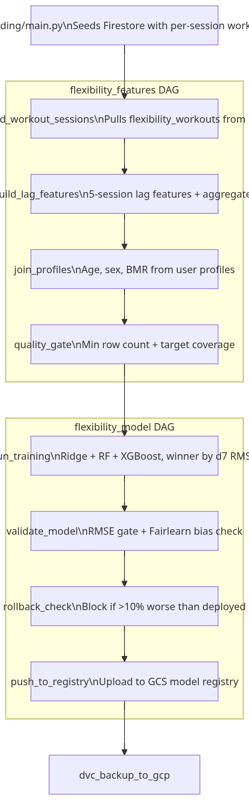


### Feature Design

Each training row represents a user at reference session `t`. Features are derived from the 5 sessions immediately before `t`.

**Lag features (5 lags × 5 signals = 25 columns):**

| Feature | Description |
|---------|-------------|
| `score_lag_1..5` | Flexibility score at each session |
| `effort_lag_1..5` | Effort level (1–5) |
| `duration_lag_1..5` | Session duration (minutes) |
| `reach_lag_1..5` | Sit-and-reach measurement (cm) |
| `days_ago_lag_1..5` | Days before reference session |

**Aggregate features:**

| Feature | Description |
|---------|-------------|
| `workout_count_7d`, `_14d` | Session frequency |
| `mean_score_5`, `score_trend_5` | Recent score level and trajectory |
| `mean_effort_5` | Recent effort consistency |
| `days_since_last`, `current_streak` | Rest and consistency indicators |

**Profile features:** `age`, `sex_encoded`, `bmr`, `age_bucket_enc`

**Targets:** `target_d1`, `target_d3`, `target_d7`, `target_d14`

---

## Strength Model Pipeline

The strength model predicts a user's composite strength score at +1, +3, +7, and +14 days ahead, derived from Epley 1RM estimates and workout volume from cleaned weightlifting data.

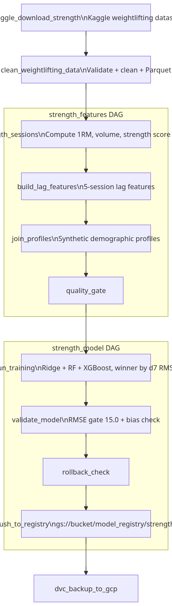


**Strength Score Formula:**
```
strength_score = max_1rm × 0.4 + total_1rm_volume × 0.3 + total_weight × 0.2 + num_sets × 0.1
```

**Lag features (5 lags × 5 signals):** `max_1rm_lag`, `avg_1rm_lag`, `volume_lag`, `strength_lag`, `days_ago_lag`

**Gate threshold:** `STRENGTH_RMSE_THRESHOLD` (default 2000.0 — raw score units, not 0-100)

---

## Energy Model Pipeline

The energy model predicts a daily energy score (0–100) from sleep, quiz, and activity features using the Kaggle Sleep Health dataset as a proxy for real user data.

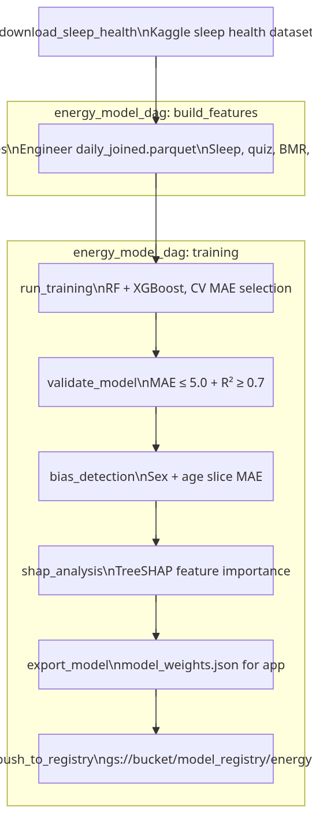


**Energy Score Formula:**
```
energy_score = sleep_satisfaction × 55 + avg_accuracy × 35 + min(attempts/5, 1) × 10
```

**Validation thresholds:** `ENERGY_MAE_THRESHOLD` (default 5.0), `ENERGY_R2_THRESHOLD` (default 0.7)

---

## Food Pipeline

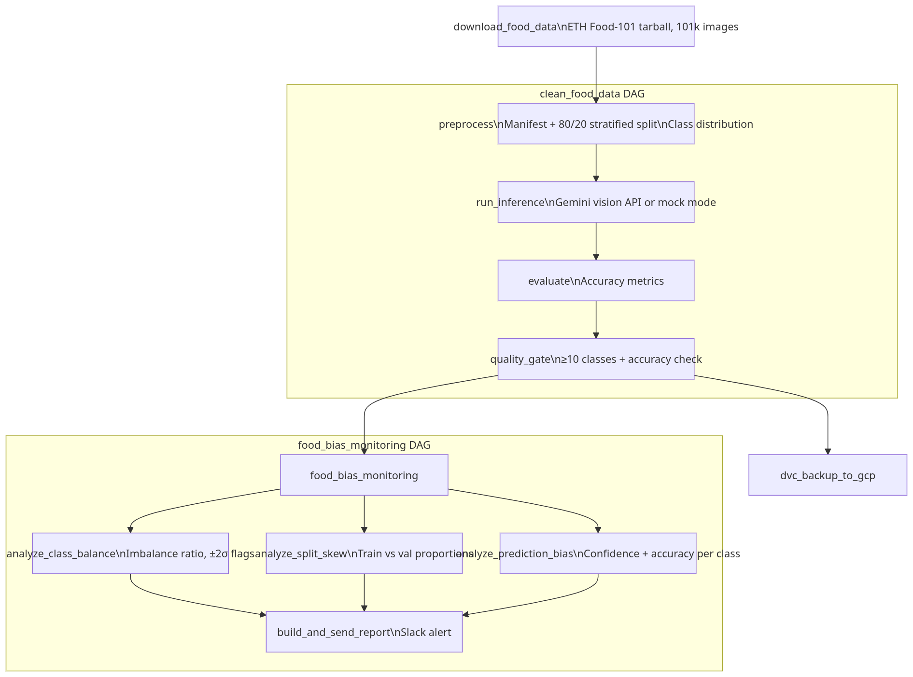


**Gemini inference:** Set `GEMINI_API_KEY` Airflow Variable for real inference. Without it, mock mode runs automatically.

---

## Behavior Analytics Pipeline

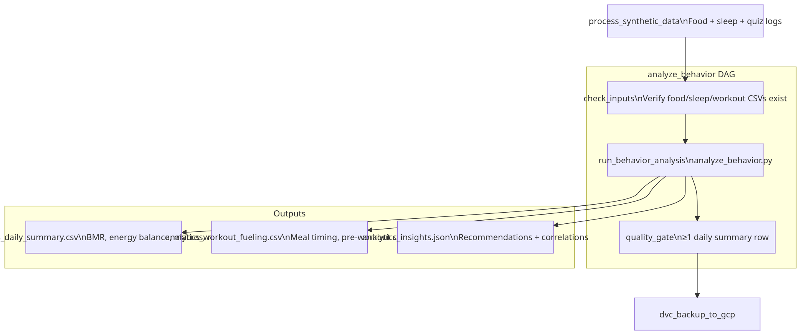


**User profile** is read from Airflow Variables: `BEHAVIOR_WEIGHT_KG`, `BEHAVIOR_HEIGHT_CM`, `BEHAVIOR_AGE`, `BEHAVIOR_SEX` (defaults: 75kg / 175cm / 30 / male)

---

## Synthetic Data Pipeline


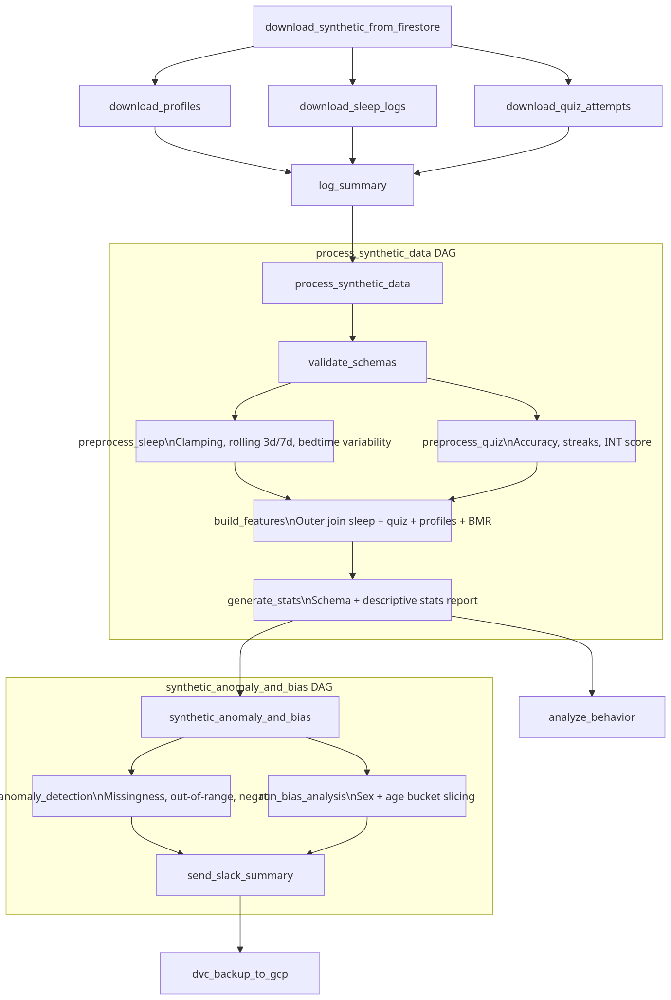

---

## Firestore Pipeline

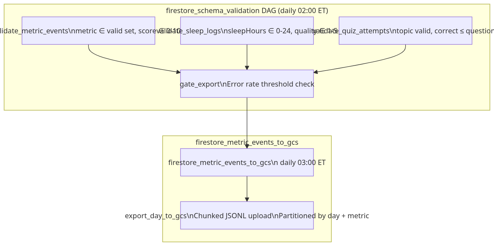


---

## Model Training Architecture

All three ML models (flexibility, strength, energy) share the same training pattern:

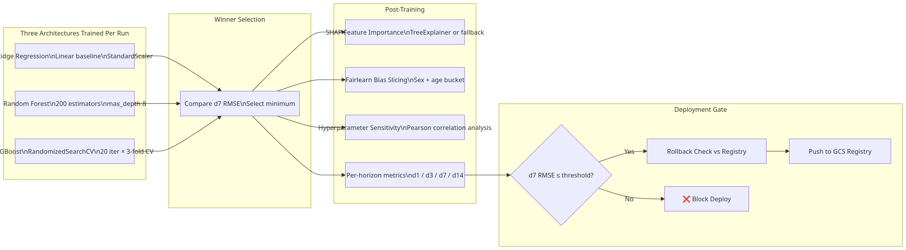


---

## CI/CD Workflows

Three GitHub Actions workflows, one per model:

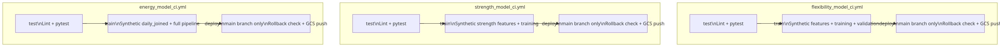


**CI synthetic data:** All three workflows generate synthetic feature files in CI so training runs end-to-end without real Firestore or Kaggle data.

**Rollback check:** Skipped in CI (`CI=true` env var) — only enforced in production via Airflow DAGs where real data is used.

### GitHub Secrets Required

| Secret | How to generate |
|--------|----------------|
| `GCP_SA_KEY` | `base64 -i secrets/gcp-sa.json \| tr -d '\n'` |
| `FIREBASE_SA_KEY` | `base64 -i secrets/firebase-admin.json \| tr -d '\n'` |
| `KAGGLE_USERNAME` | plain text |
| `KAGGLE_KEY` | plain text |
| `SLACK_WEBHOOK_URL` | plain text |

### GitHub Variables Required

| Variable | Value |
|----------|-------|
| `GCS_BACKUP_BUCKET` | `raw_data_lvlup` |
| `MODEL_RMSE_THRESHOLD` | `10.0` |
| `ENERGY_MAE_THRESHOLD` | `5.0` |
| `ENERGY_R2_THRESHOLD` | `0.7` |

---

## Bias Detection

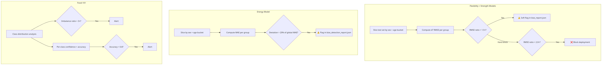


**Mitigation strategies** documented in all bias reports:
1. Collect more data from underrepresented groups
2. Apply inverse-frequency sample weighting
3. Use stratified CV splits by demographic group
4. Data augmentation or synthetic oversampling
5. Fairness constraints during optimization
6. Regular bias audits post-deployment

---

## Model Outputs

### Flexibility + Strength

```
data/models/{flexibility|strength}/
├ model.pkl                          winning MultiOutputRegressor
├ metrics.json                       full metrics, model comparison, SHAP, sensitivity
├ bias_report.json                   Fairlearn per-slice RMSE (sex, age group)
├ shap_summary.png                   SHAP beeswarm (d7 horizon)
└ plots/
    ├ 01_horizon_rmse_comparison.png
    ├ 02_model_selection.png
    ├ 03_shap_top10.png
    ├ 04_bias_sex.png
    ├ 05_bias_age.png
    ├ 06_hyperparam_sensitivity.png
    └ 07_score_distribution.png
```

### Energy

```
data/models/energy/
├ best_model.joblib
├ model_weights.json                 exported for app JS inference engine
├ training_metadata.json
└ reports/
    ├ validation_report.json
    ├ bias_detection_report.json
    └ shap_feature_importance.json
```

---


## Data Versioning

DVC tracks `data/raw/`, `data/processed/`, and `data/models/` with a GCS remote backend.

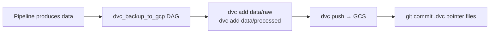

The `dvc.yaml` file defines these stages for local `dvc repro` execution:

| Stage | Command |
|-------|---------|
| `download_weightlifting` | Kaggle download |
| `download_wisdm` | UCI download |
| `clean_weightlifting` | Validation + Parquet |
| `clean_wisdm` | Validation + Parquet |
| `compute_stamina` | Windowing + stamina |
| `bias_analysis` | WISDM + weightlifting bias |
| `train_flexibility_model` | `python scripts/model_train.py --model-type flexibility` |
| `strength_features` | Feature engineering |
| `train_strength_model` | `python scripts/model_train.py --model-type strength` |
| `run_tests` | `pytest tests/` |

---

## Testing

167 tests across 10 modules:

| Module | Tests | What's covered |
|--------|-------|----------------|
| `test_wisdm_loader.py` | 11 | File loading, semicolon parsing, malformed/empty files, multi-file concat |
| `test_weightlifting_cleaning.py` | 14 | Row validation, schema check, deduplication |
| `test_stamina_and_anomaly.py` | 22 | Windowing, stamina monotonic decrease, anomaly detection, row validation |
| `test_schema_validation.py` | 20 | Firestore metric_events, sleep_logs, quiz_attempts |
| `test_synthetic_pipeline.py` | 33 | Time parsing, BMR, INT score, anomaly detection, age bucketing, schema |
| `test_flexibility_features.py` | 16 | `_slope`, `_future_score`, `_bmr`, `_age_enc`, lag features |
| `test_strength_features.py` | 16 | Same helpers applied to strength data, strength-specific lag construction |
| `test_model_train.py` | 14 | Time split, feature cols, prepare, RMSE, sensitivity, smoke test, gate |
| `tests/energy/test_bias.py` | 4 | Age bucket assignment, slice metrics, flagging |
| `tests/energy/test_train.py` | 5 | Data loading, model training, selection, predictions, score range |
| `tests/energy/test_validate.py` | 6 | Metrics computation, gate pass/fail, plot generation |

```bash
pytest                                           # all 167 tests
pytest tests/test_flexibility_features.py        # single module
pytest tests/test_model_train.py -m "not slow"   # skip smoke tests
pytest -k "test_stamina"                         # by name pattern
pytest --cov --cov-report=term-missing           # with coverage
```

---

## Useful Commands

```bash
#  Airflow 
docker exec -it airflow-scheduler bash
airflow dags list
airflow dags trigger <dag_id>
airflow dags list-import-errors
airflow tasks logs <dag_id> <task_id> <run_id>

# Trigger specific pipelines
docker exec airflow-scheduler airflow dags trigger flexibility_features
docker exec airflow-scheduler airflow dags trigger strength_features
docker exec airflow-scheduler airflow dags trigger energy_model_dag
docker exec airflow-scheduler airflow dags trigger analyze_behavior

# Live log tail
docker exec airflow-scheduler bash -c \
  "find /opt/airflow/logs/dag_id=flexibility_model -name '*.log' | sort | tail -1 | xargs tail -f"

#  Models 
# Check flexibility model output
docker exec airflow-scheduler cat /opt/airflow/data/models/flexibility/metrics.json | \
  python -c "import json,sys; m=json.load(sys.stdin); print('Winner:', m['winner_model'], '| d7 RMSE:', m['gate_rmse'])"

# Check strength model output
docker exec airflow-scheduler cat /opt/airflow/data/models/strength/metrics.json | \
  python -c "import json,sys; m=json.load(sys.stdin); print('Winner:', m['winner_model'], '| d7 RMSE:', m['gate_rmse'])"

# Regenerate plots
docker exec airflow-scheduler python /opt/airflow/scripts/generate_plots.py

# Train locally
python scripts/model_train.py --model-type flexibility --rmse-threshold 10.0
python scripts/model_train.py --model-type strength --rmse-threshold 2000.0

#  Data Seeding 
docker exec airflow-scheduler python /opt/airflow/data_seeding/main.py \
  --service-account /opt/airflow/secrets/firebase-admin.json \
  --num-users 20 --days 90 --seed 42

#  DVC 
dvc status
dvc repro
dvc push
dvc pull
dvc diff

#  GitHub Actions 
gh workflow list
gh workflow run flexibility_model_ci.yml
gh workflow run energy_model_ci.yml
gh workflow run strength_model_ci.yml
gh run view --log-failed

#  Docker 
docker compose logs -f airflow-scheduler
docker compose logs -f airflow-mlflow
docker compose ps

# Reset (dev only)
docker compose down -v
docker compose up -d

#  MLflow 
open http://localhost:5001
```