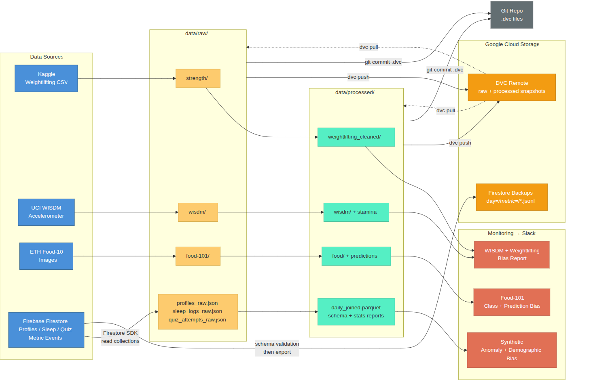

# Level Up - MLOps Data Pipeline

End-to-end MLOps data pipeline for fitness and activity tracking data. Covers ingestion, cleaning, validation, stamina computation, bias monitoring, versioning, and alerting - orchestrated with Apache Airflow and versioned with DVC.

## Requirements

- Python 3.11+
- Docker + Docker Compose
- Kaggle API credentials (for dataset downloads)
- GCP service account (for Firestore + GCS)
- Slack webhook URL (for alerts)

## Setup

### 1. Clone and configure environment

Create a `.env` file (do not commit):

```bash
KAGGLE_USERNAME=your_username
KAGGLE_KEY=your_api_key

AIRFLOW_UID=1000
```

### 2. Start Airflow

```bash
docker compose up -d
docker compose ps
```

Airflow UI: [http://localhost:8080](http://localhost:8080) (default: `admin` / `admin`)

### 3. Initialize DVC

```bash
dvc init
dvc remote add -d gcs_remote gs://your-bucket/dvc-store
dvc remote modify gcs_remote credentialpath secrets/gcp-sa.json

dvc add data/raw
dvc add data/processed

git add dvc.yaml dvc.lock data/raw.dvc data/processed.dvc .dvc/ .gitignore
git commit -m "feat: initialize DVC tracking"
dvc push
```

### 4. Run Tests

```bash
pip install pytest pytest-cov
pytest
pytest --cov=tests --cov-report=term-missing
```

## Pipeline Overview



### DAG Dependency Flow

```
Download DAGs (manual trigger)
├── download_wisdm_accel                → data/raw/wisdm/
├── kaggle_download_strength            → data/raw/strength/
├── kaggle_download_flexibility         → data/raw/flexibility/
├── download_food_data                  → data/raw/food-101/
│       ↓ triggers
│   clean_food_data (processing_dags/)
│     manifest → splits → distribution + inference → quality gate
│       ↓ triggers
│   food_bias_monitoring (monitoring_dags/)
│     class balance → split skew → prediction bias → slack
│       ↓ triggers
│   dvc_backup_to_gcp
└── download_synthetic_from_firestore   → data/raw/*.json (profiles, sleep, quiz)
        │                                    ↓ triggers
        │                               process_synthetic_data (processing_dags/)
        │                                 validate → sleep + quiz (parallel) → join → stats
        │                                    ↓ triggers
        │                               synthetic_anomaly_and_bias (monitoring_dags/)
        │                                 anomaly detection → bias analysis → slack
        ▼                                    ↓ triggers
Processing DAGs (manual or triggered)        │
├── clean_weightlifting_data       → data/processed/weightlifting_cleaned/
│   └── triggers: dvc_backup_to_gcp          │
├── clean_wisdm_accel_data         → data/processed/wisdm/
│   └── triggers: dvc_backup_to_gcp          │
└── firestore_schema_validation    (daily 02:00 ET)
    └── triggers: firestore_metric_events_to_gcs
        │                                    │
        ▼                                    ▼
Backup DAGs
├── dvc_backup_to_gcp              → DVC add/push raw + processed, git commit
└── firestore_metric_events_to_gcs → GCS JSONL partitioned by day/metric
        │
        ▼
Monitoring DAGs (daily 06:00 ET)
├── daily_bias_monitoring          → Slack report (WISDM + weightlifting)
└── food_bias_monitoring           → Slack report (Food-101 class/prediction bias)
```

### Food-101 Pipeline

End-to-end chain triggered by a single command:

```
download_food_data
  download + extract Food-101 tarball (101 classes, ~101k images)
        ↓ triggers
clean_food_data
  build_manifest → create_splits (80/20 stratified) → class_distribution + mock_inference → quality_gate
        ↓ triggers both
food_bias_monitoring                    dvc_backup_to_gcp
  class_balance (imbalance ratio,         tracks data/raw + data/processed
    under/over-represented ±2σ)
  split_skew (train vs val proportions)
  prediction_bias (confidence + accuracy per class)
  → Slack report
```

### Synthetic Data Pipeline (Firestore)

End-to-end chain triggered by a single command:

```
download_synthetic_from_firestore
  download_profiles → download_sleep_logs + download_quiz_attempts (parallel)
        ↓ triggers
process_synthetic_data
  validate_schemas → preprocess_sleep + preprocess_quiz (parallel) → build_features → generate_stats
        ↓ triggers
synthetic_anomaly_and_bias
  anomaly_detection → bias_analysis → slack_summary
        ↓ triggers
dvc_backup_to_gcp
```

**Download** (`download_synthetic_from_firestore`):
- Pulls user profiles (age, sex, height, weight) from `users/{uid}.profile`
- Pulls sleep logs from `users/{uid}/sleep_logs/*`
- Pulls quiz attempts from `users/{uid}/quiz_attempts/*`
- Writes `profiles_raw.json`, `sleep_logs_raw.json`, `quiz_attempts_raw.json` to `data/raw/`

**Processing** (`process_synthetic_data`):
- Validates raw JSON schemas (required fields, correct types)
- Preprocesses sleep: clamps hours to [2,14], parses bed/wake times, computes midpoint, satisfaction, rolling 3d/7d averages, bedtime variability
- Preprocesses quiz: computes accuracy, filters impossible values, daily aggregation, streak tracking, INT score (accuracy × 75 + streak bonus × 25), rolling 3d/7d averages
- Joins sleep + quiz + profiles with outer merge, adds BMR (Mifflin–St Jeor equation)
- Generates schema report and descriptive statistics (per-column mean, std, min, max, missing %)

**Anomaly Detection & Bias** (`synthetic_anomaly_and_bias`):
- Missingness >20% in key fields
- Out-of-range: sleep outside [2,14]h, accuracy outside [0,1], time per question >300s
- Negative values in sleep_hours, attempts_count, int_score, bmr
- Bias slicing by sex and age bucket (<20, 20-29, 30-39, 40+)
- Per-slice metrics: mean INT score, mean accuracy, mean sleep hours
- Flags imbalanced groups with <10 samples
- Mitigation notes: re-sampling, sample weighting, stratified splits, per-slice monitoring
- Sends Slack report with anomaly + bias summary

### Data Sources

| Source | Type | DAG | Raw Location |
|--------|------|-----|--------------|
| Kaggle weightlifting | CSV (9,932 rows, 10 cols) | `kaggle_download_strength` | `data/raw/strength/` |
| UCI WISDM | Accel txt (15.6M rows, 6 cols) | `download_wisdm_accel` | `data/raw/wisdm/` |
| ETH Food-101 | Images (101 classes, 101k images) | `download_food_data` | `data/raw/food-101/` |
| Firestore (synthetic) | JSON (profiles, sleep, quiz) | `download_synthetic_from_firestore` | `data/raw/*.json` |
| Firestore (live) | NoSQL (metric_events) | `firestore_metric_events_to_gcs` | GCS bucket |

### Data Cleaning

**Weightlifting** (`clean_weightlifting_dag.py`):
- Schema validation (required columns: Date, Workout Name, Exercise Name, Set Order, Weight, Reps)
- Whitespace stripping on all string columns
- Type coercion (dates, floats, nullable ints)
- Deduplication on natural key
- Row-level validation: negative values, out-of-range weight (>700kg), reps (>200), set order, seconds, distance
- Output: clean Parquet + rejection CSV with tagged reasons
- Quality gate: blocks pipeline if rejection rate >15%

**WISDM** (`clean_wisdm_dag.py`):
- Semicolon stripping from z-axis values
- Type coercion for all numeric columns
- Deduplication
- Row validation: valid activity codes (A-S, no N), missing axes, extreme magnitude (>200)
- 200-row windowing with mean aggregation
- Sequential stamina computation (fatigue drain based on acceleration magnitude)
- Anomaly detection (5σ magnitude spikes)
- Per-activity bias analysis
- Output: clean Parquet, stamina Parquet, bias JSON

**Firestore Live** (`firebase_schema_validation_dag.py`):

**Food-101** (`clean_food_dag.py`):
- Builds manifest from meta/train.txt + meta/test.txt, validates image paths exist
- Creates stratified 80/20 train/val split
- Generates class distribution CSV
- Runs mock Gemini inference on val set (produces predictions JSONL)
- Quality gate: blocks if >20% images missing or <10 classes found
- Output: manifest CSV, train/val CSVs, class distribution, predictions JSONL

**Firestore Live** (`firebase_schema_validation_dag.py`):
- Validates metric_events: metric ∈ {strength, stamina, speed, flexibility, intelligence}, score ∈ [0,100], confidence ∈ [0,1], payload component keys
- Validates sleep_logs: sleepHours ∈ [0,24], quality ∈ [1,5], time formats
- Validates quiz_attempts: valid topics, num_correct ≥ 0, num_correct ≤ num_questions, difficulty ∈ [1,5]
- Configurable error threshold gate before allowing GCS export

### Bias Detection and Monitoring

The `daily_bias_monitoring` DAG runs daily and analyzes:

**WISDM / Stamina:**
- Stamina distribution across all 18 activity types (mean, std, min, max)
- Per-user stamina spread and outlier detection (>2σ from global mean)
- Activity gap analysis (% difference between highest and lowest mean stamina)

**Weightlifting:**
- Exercise volume concentration (top 5 exercises as % of total volume)
- Weight progression trend (recent 30 days vs older data)
- Workout frequency distribution by day of week

**Food-101** (via `food_bias_monitoring`):
- Class imbalance: ratio of largest to smallest class, flags under/over-represented (±2σ)
- Train/val split skew: per-class proportion difference between train and val sets
- Prediction confidence bias: per-class mean confidence, flags classes <0.7
- Per-class accuracy: worst 5 and best 5 classes
- Alerts if imbalance ratio >3x, split skew >1%, or accuracy <0.8

**Synthetic / Firestore** (via `synthetic_anomaly_and_bias`):
- Slicing by sex and age bucket (<20, 20-29, 30-39, 40+)
- Per-slice metrics: mean INT score, mean accuracy, mean sleep hours
- Imbalance detection: flags slices with <10 samples
- Mitigation notes: re-sampling, sample weighting, stratified splits, per-slice monitoring

**Alert thresholds:**
- Activity stamina gap >50%
- Outlier users detected
- Top 5 exercises >80% of total volume
- Imbalanced demographic slices
- Food class imbalance ratio >3x
- Food train/val split skew >1%
- Food prediction accuracy <0.8
- Food classes with confidence <0.7

Reports are sent to Slack via webhook with formatted Block Kit messages.

### Logging and Monitoring

All DAGs use a shared `dag_monitoring.py` module providing:
- Structured logging via `logging.getLogger("airflow.task")` (replaces all `print()` calls)
- Task-level callbacks: `on_failure_callback`, `on_success_callback`, `on_retry_callback`
- DAG-level callbacks: `on_dag_failure_callback`
- SLA monitoring with `on_sla_miss_callback`
- Slack webhook alerts on failures and SLA misses
- `emit_metric()` — writes structured JSONL to `/opt/airflow/logs/dag_metrics/` for external scraping

| DAG | SLA Budget |
|-----|-----------|
| Kaggle downloads | 15 min |
| Food-101 download | 30 min |
| Food-101 cleaning | 30 min |
| Food bias monitoring | 15 min |
| Firestore synthetic download | 15 min |
| DVC backup | 20 min |
| Weightlifting cleaning | 30 min |
| WISDM cleaning | 30 min |
| Synthetic data processing | 30 min |
| Synthetic anomaly & bias | 20 min |
| Firestore validation | 45 min |
| Firestore export | 60 min |
| Daily bias monitoring | 20 min |

### Data Versioning

DVC tracks `data/raw/` and `data/processed/` with a GCS remote backend. The `dvc_backup_to_gcp` DAG automates:
1. `dvc add data/raw` and `dvc add data/processed` (in parallel)
2. `dvc push` to GCS
3. `git commit` of `.dvc` files

Reproducibility: clone the repo, run `dvc pull`, and all data is restored from GCS.

The `dvc.yaml` file also defines the full pipeline for local `dvc repro` execution outside of Airflow.

### Testing

~130 tests across 6 modules using pytest:

| Module | Tests | Coverage |
|--------|-------|----------|
| `test_wisdm_loader.py` | 11 | File loading, semicolon parsing, malformed/empty files, multi-file concat |
| `test_weightlifting_cleaning.py` | 14 | Row validation (all issue types), schema check, deduplication |
| `test_stamina_and_anomaly.py` | 22 | Windowing (size, edge cases), stamina (monotonic decrease, floor at 0, fatigue rates), anomaly detection, WISDM row validation |
| `test_schema_validation.py` | 20 | Firestore metric_events/sleep_logs/quiz_attempts validation, parametrized across all metrics and topics |
| `test_synthetic_pipeline.py` | 33 | Time parsing, BMR calculation, INT score, anomaly detection, age bucketing, schema validation for profiles/sleep/quiz |
| `test_food_pipeline.py` | 30 | Manifest building, class balance (balanced/imbalanced), split skew detection, mock inference, prediction bias, quality gate edge cases |

Run:
```bash
pytest                                    # all tests
pytest tests/test_wisdm_loader.py         # single module
pytest -k "test_stamina"                  # by name pattern
pytest --cov --cov-report=term-missing    # with coverage
```

## Useful Commands

```bash
# Airflow
docker exec -it airflow-scheduler bash
airflow dags list
airflow dags trigger <dag_id>
airflow tasks test <dag_id> <task_id> <date>
airflow dags list-import-errors


# Run the full synthetic pipeline end-to-end
airflow dags trigger download_synthetic_from_firestore
# Run the full food pipeline end-to-end
airflow dags trigger download_food_data

# DVC
dvc status
dvc repro
dvc push
dvc pull
dvc diff

# Logs
docker compose logs -f airflow-scheduler
docker compose logs -f postgres

# Reset (dev only)
docker compose down -v
docker compose up -d
```